# Documentación: Análisis Exploratorio y Evaluación de Calidad de Datos

---

## 2. Metadatos del entorno

* **Motor**: PostgreSQL
* **BD**: EcommerceDB
* **Herramientas**: DBeaver

---

## 3. Inventario y esquema (captura inicial)

### 3.1 Listado de tablas y vistas

**SQL:**

```sql
SELECT table_schema, table_name, table_type
FROM information_schema.tables
WHERE table_schema NOT IN ('pg_catalog','information_schema')
ORDER BY table_schema, table_name;
```

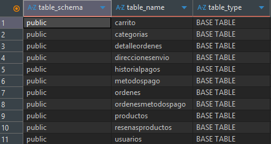

> tabla con columnas `schema`, `table_name`, `table_type`.

### 3.2 Columnas por tabla (estructura)

**SQL:**

```sql
SELECT column_name, data_type, is_nullable, character_maximum_length, column_default
FROM information_schema.columns
WHERE table_schema = 'public' AND table_name = 'mi_tabla'
ORDER BY ordinal_position;
```
> Carrito
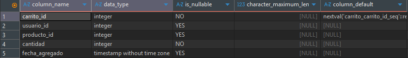

> Categorias
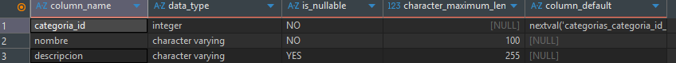

> DetalleOrdenes
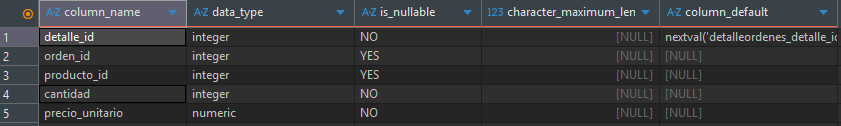

> DireccionesEnvio
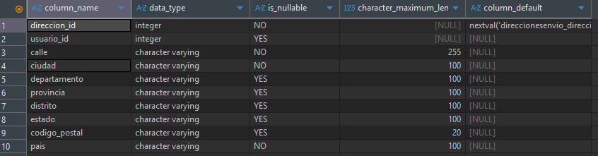

> HistorialPagos
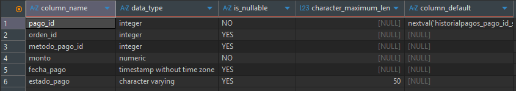

> MetodosPago
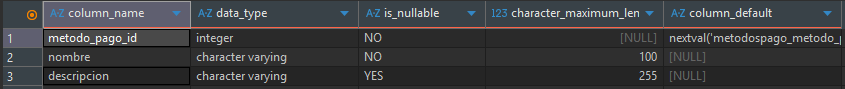

> Ordenes
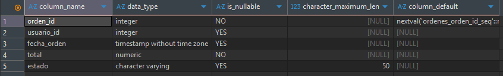

> OrdenesMetodosPago


> Productos
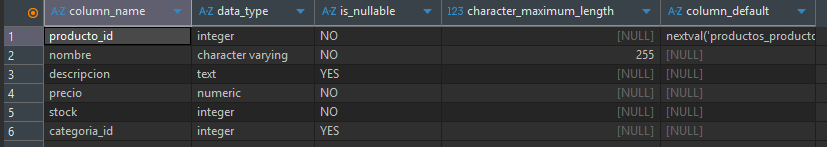

> ResenasProductos


> Usuarios
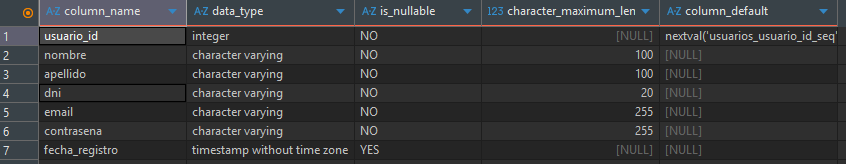

### 3.3 Relaciones explícitas (constraints)

**SQL:**

```sql
SELECT tc.constraint_name, tc.table_name, kcu.column_name,
       ccu.table_name AS foreign_table, ccu.column_name AS foreign_column
FROM information_schema.table_constraints AS tc
JOIN information_schema.key_column_usage AS kcu
  ON tc.constraint_name = kcu.constraint_name
JOIN information_schema.constraint_column_usage AS ccu
  ON ccu.constraint_name = tc.constraint_name
WHERE constraint_type = 'FOREIGN KEY' AND tc.table_schema = 'public';
```

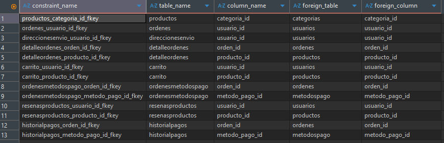

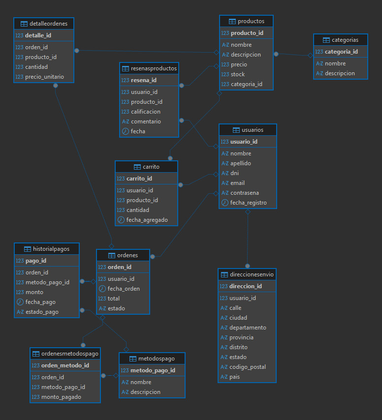

---

## 4. Perfil básico de contenido por tabla

### 4.1 Conteos y tamaños

```sql
SELECT COUNT(*) AS total_rows,
       (SELECT COUNT(*) FROM information_schema.columns WHERE table_name='mi_tabla') AS n_columns
FROM public.mi_tabla;
```

| Tabla                 | Total Rows | N° Columnas |
|-----------------------|------------|--------------|
| Carrito               | 4664       | 5            |
| Categoria             | 12         | 0            |
| detalleordenes        | 8689       | 5            |
| direccionesenvio      | 1000       | 10           |
| historialpagos        | 10000      | 6            |
| metodospago           | 7          | 3            |
| ordenes               | 10000      | 5            |
| ordenesmetodospago    | 10000      | 4            |
| productos             | 36         | 6            |
| resenasproductos      | 7172       | 6            |
| usuarios              | 1000       | 7            |


### 4.2 Muestra representativa

```sql
SELECT * FROM public.mi_tabla
ORDER BY <fecha_o_pk> DESC
LIMIT 5;
```
> Carrito
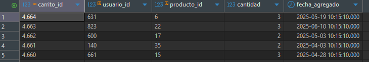

> Categorias
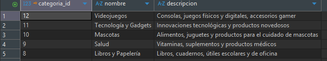

> DetalleOrdenes


> DireccionesEnvio
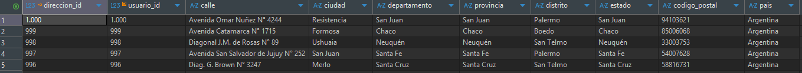

> HistorialPagos
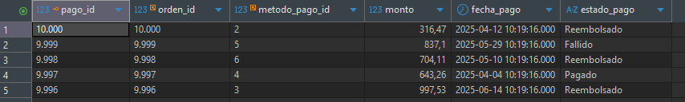

> MetodosPago
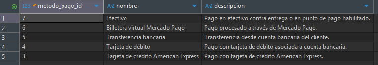

> Ordenes
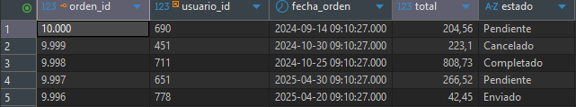

> OrdenesMetodosPago
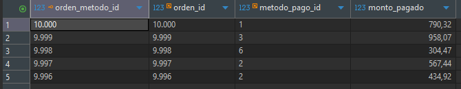

> Productos
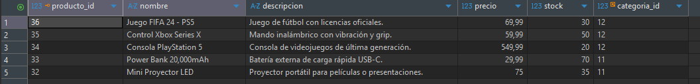

> ResenasProductos
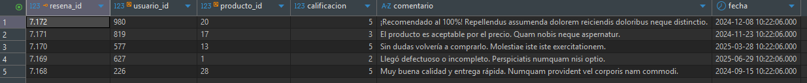

> Usuarios
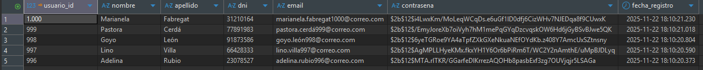

---

## 5. Detección de claves implícitas y relaciones

### 5.1 Resumen estructural de claves foráneas
| Tabla               | Columna FK      | Referencia                       |
|---------------------|------------------|----------------------------------|
| Productos           | CategoriaID      | Categorias(CategoriaID)         |
| Ordenes             | UsuarioID        | Usuarios(UsuarioID)             |
| DetalleOrdenes      | OrdenID          | Ordenes(OrdenID)                |
| DetalleOrdenes      | ProductoID       | Productos(ProductoID)           |
| DireccionesEnvio    | UsuarioID        | Usuarios(UsuarioID)             |
| Carrito             | UsuarioID        | Usuarios(UsuarioID)             |
| Carrito             | ProductoID       | Productos(ProductoID)           |
| OrdenesMetodosPago  | OrdenID          | Ordenes(OrdenID)                |
| OrdenesMetodosPago  | MetodoPagoID     | MetodosPago(MetodoPagoID)       |
| ReseñasProductos     | UsuarioID        | Usuarios(UsuarioID)             |
| ReseñasProductos     | ProductoID        | Productos(ProductoID)           |
| HistorialPagos      | OrdenID          | Ordenes(OrdenID)                |
| HistorialPagos      | MetodoPagoID     | MetodosPago(MetodoPagoID)       |

---

## 6. Análisis complementario en Python

Se realizaron análisis adicionales usando table_to_df, null_count, null_percentage, duplicates_count, duplicated_rows, iqr_outliers, negative_values e invalid_categories.

>Calidad de datos

Conversión de todas las tablas a DataFrames para su inspección.

Evaluación de nulos y duplicados (sin problemas relevantes).

Validación de valores negativos y categorías inválidas (sin hallazgos críticos).

>Outliers

Los outliers detectados por IQR en precios y stock son coherentes con la variabilidad natural del catálogo (remeras económicas vs. electrodomésticos de alto valor).
No se consideran errores.

>Observación importante

Algunos correos contienen espacios. Se documenta el comportamiento, pero se mantiene sin cambios por ahora.

>📍 Notebook del análisis

El análisis completo está disponible en:

* notebooks\notebook_analysis.ipynb

---

## 7. Data Dictionary

| tabla             | columna          | tipo              | nullable |
|-------------------|------------------|-------------------|----------|
| usuarios          | usuario_id       | INTEGER           | False    |
| usuarios          | nombre           | VARCHAR(100)      | False    |
| usuarios          | apellido         | VARCHAR(100)      | False    |
| usuarios          | dni              | VARCHAR(20)       | False    |
| usuarios          | email            | VARCHAR(255)      | False    |
| usuarios          | contrasena       | VARCHAR(255)      | False    |
| usuarios          | fecha_registro   | DATETIME          | True     |
| categorias        | categoria_id     | INTEGER           | False    |
| categorias        | nombre           | VARCHAR(100)      | False    |
| categorias        | descripcion      | VARCHAR(255)      | True     |
| productos         | producto_id      | INTEGER           | False    |
| productos         | nombre           | VARCHAR(255)      | False    |
| productos         | descripcion      | TEXT              | True     |
| productos         | precio           | NUMERIC(10,2)     | False    |
| productos         | stock            | INTEGER           | False    |
| productos         | categoria_id     | INTEGER           | True     |
| ordenes           | orden_id         | INTEGER           | False    |
| ordenes           | usuario_id       | INTEGER           | True     |
| ordenes           | fecha_orden      | DATETIME          | True     |
| ordenes           | total            | NUMERIC(10,2)     | False    |
| ordenes           | estado           | VARCHAR(50)       | True     |
| detalleordenes    | detalle_id       | INTEGER           | False    |
| detalleordenes    | orden_id         | INTEGER           | True     |
| detalleordenes    | producto_id      | INTEGER           | True     |
| detalleordenes    | cantidad         | INTEGER           | False    |
| detalleordenes    | precio_unitario  | NUMERIC(10,2)     | False    |
| direccionesenvio  | direccion_id     | INTEGER           | False    |
| direccionesenvio  | usuario_id       | INTEGER           | True     |
| direccionesenvio  | calle            | VARCHAR(255)      | False    |
| direccionesenvio  | ciudad           | VARCHAR(100)      | False    |
| direccionesenvio  | departamento     | VARCHAR(100)      | True     |
| direccionesenvio  | provincia        | VARCHAR(100)      | True     |
| direccionesenvio  | distrito         | VARCHAR(100)      | True     |
| direccionesenvio  | estado           | VARCHAR(100)      | True     |
| direccionesenvio  | codigo_postal    | VARCHAR(20)       | True     |
| direccionesenvio  | pais             | VARCHAR(100)      | False    |
| carrito           | carrito_id       | INTEGER           | False    |
| carrito           | usuario_id       | INTEGER           | True     |
| carrito           | producto_id      | INTEGER           | True     |
| carrito           | cantidad         | INTEGER           | False    |
| carrito           | fecha_agregado   | DATETIME          | True     |
| metodospago       | metodo_pago_id   | INTEGER           | False    |
| metodospago       | nombre           | VARCHAR(100)      | False    |
| metodospago       | descripcion      | VARCHAR(255)      | True     |
| ordenesmetodospago| orden_metodo_id  | INTEGER           | False    |
| ordenesmetodospago| orden_id         | INTEGER           | True     |
| ordenesmetodospago| metodo_pago_id   | INTEGER           | True     |
| ordenesmetodospago| monto_pagado     | NUMERIC(10,2)     | False    |
| resenasproductos  | resena_id        | INTEGER           | False    |
| resenasproductos  | usuario_id       | INTEGER           | True     |
| resenasproductos  | producto_id      | INTEGER           | True     |
| resenasproductos  | calificacion     | INTEGER           | True     |
| resenasproductos  | comentario       | TEXT              | True     |
| resenasproductos  | fecha            | DATETIME          | True     |
| historialpagos    | pago_id          | INTEGER           | False    |
| historialpagos    | orden_id         | INTEGER           | True     |
| historialpagos    | metodo_pago_id   | INTEGER           | True     |
| historialpagos    | monto            | NUMERIC(10,2)     | False    |
| historialpagos    | fecha_pago       | DATETIME          | True     |
| historialpagos    | estado_pago      | VARCHAR(50)       | True     |
<sub>Queda por colocar ejemplos, descripciones y reglas de negocio.</sub>

---

## 8. Checklist final

* [x] Inventario de tablas completo
* [x] Data dictionary generado
* [x] Nulos / duplicados / outliers reportados con conteos
* [x] Scripts de corrección propuestos y revisados
* [x] Plan de monitorización de calidad definido

---

*Fin del documento.*
