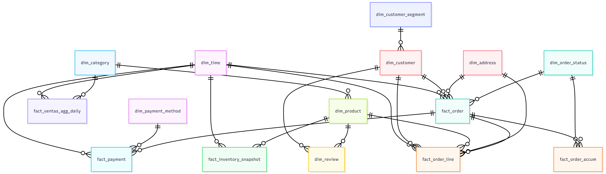
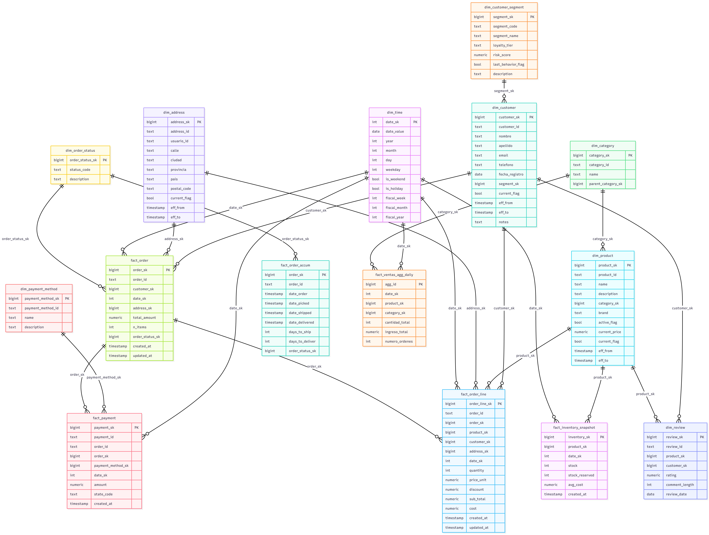

# 📊 Preguntas de Análisis de Datos – E-commerce

## 🛒 **Ventas**
- ¿Cuáles son los productos más vendidos por volumen?  
- ¿Cuál es el ticket promedio por orden?  
- ¿Cuáles son las categorías con mayor número de productos vendidos?  
- ¿Qué día de la semana se generan más ventas?  
- ¿Cuántas órdenes por mes se generan y cuál es su variación mensual?  

---

## 💳 **Pagos y Transacciones**
- ¿Cuáles son los métodos de pago más utilizados?  
- ¿Cuál es el monto promedio pagado por método de pago?  
- ¿Cuántas órdenes se pagaron usando más de un método de pago?  
- ¿Cuántos pagos están en estado “Procesando” o “Fallido”?  
- ¿Cuál es el monto total recaudado por mes?  

---

## 👤 **Usuarios**
- ¿Cuántos usuarios se registran por mes?  
- ¿Cuántos usuarios han realizado más de una orden?  
- ¿Cuántos usuarios registrados no han hecho ninguna compra?  
- ¿Qué usuarios han gastado más en total?  
- ¿Cuántos usuarios han dejado reseñas?  

---

## 📦 **Productos y Stock**
- ¿Qué productos tienen alto stock pero bajas ventas?  
- ¿Cuántos productos están actualmente fuera de stock?  
- ¿Cuáles son los productos peor calificados?  
- ¿Qué productos tienen mayor cantidad de reseñas?  
- ¿Qué categoría tiene el mayor valor económico vendido (no solo volumen)?

# 🧮 **Medidas y 📐 Dimensiones por Área de Análisis**

## ✅ **Ventas**
**Medidas:**
- cantidad  
- precio_unitario  
- total
- **ticket_promedio = SUM(total_orden) / COUNT(order_id)**  
- ventas_volumen  
- **ventas_valor = cantidad * precio_unitario**

**Dimensiones:**
- dim_producto  
- dim_categoria  
- dim_cliente  
- dim_tiempo (día, mes, weekday)  
- dim_direccion (ciudad, provincia)  
- dim_estado_orden  

---

## 💳 **Pagos y Transacciones**
**Medidas:**
- monto_pago  
- monto_promedio_por_metodo  
- numero_metodos_por_orden  
- cantidad_pagos_procesando  
- cantidad_pagos_fallidos  
- monto_total_mes  

**Dimensiones:**
- dim_metodo_pago  
- dim_tiempo  
- dim_orden *(degenerate: order_id)*  

---

## 👤 **Usuarios**
**Medidas:**
- numero_registros_por_mes  
- numero_ordenes_por_usuario  
- gasto_total_por_usuario  
- cantidad_reseñas  
- usuarios_sin_compra *(derivada)*  

**Dimensiones:**
- dim_cliente  
- dim_tiempo *(fecha_registro)*  
- dim_segmento_cliente *(mini-dim)*  

---

## 📦 **Productos y Stock**
**Medidas:**
- stock_actual  
- stock_reservado  
- ventas_volumen  
- ventas_valor  
- numero_reseñas  
- rating_promedio  

**Dimensiones:**
- dim_producto  
- dim_categoria  
- dim_tiempo

# 📐 **Esquema Conceptual del Modelo Dimensional**

# 📐 **Esquema Logico del Modelo Dimensional**

# 🧩 **Entidades del Modelo Dimensional**

## 🔹 **Dimensiones**
Lista de dimensiones incluidas en el Data Warehouse, con su estrategia SCD cuando aplica:

- **dim_customer** — cliente *(SCD2)*
- **dim_product** — producto *(SCD2 parcial)*
- **dim_category** — categoría de producto
- **dim_address** — dirección de envío *(SCD2)*
- **dim_time** — calendario (día, mes, año, fiscal)
- **dim_payment_method** — método de pago
- **dim_order_status** — estado de la orden
- **dim_customer_segment** — segmento del cliente *(mini-dim)*
- **dim_review** — reseña *(puede ser dimensión o hecho)*

---

## 🔸 **Hechos**
Tablas de hechos definidas según el tipo de evento de negocio:

- **fact_order** — orden *(nivel orden)*
- **fact_order_line** — ítem dentro de una orden *(nivel línea)*
- **fact_payment** — pagos por transacción
- **fact_inventory_snapshot** — stock diario por producto
- **fact_order_accum** — ciclo de vida de la orden *(accumulating snapshot)*
- **fact_ventas_agg_daily** — agregados diarios × producto × categoría

# 🔗 Relaciones y Cardinalidades

| Relación                                           | Cardinalidad | Descripción                                         |
|----------------------------------------------------|--------------|-----------------------------------------------------|
| dim_customer (1) ↔ fact_order (N)                  | 1:N          | Un cliente puede tener muchas órdenes               |
| dim_customer (1) ↔ fact_order_line (N)             | 1:N          | Un cliente puede tener muchas líneas de pedido      |
| dim_customer (1) ↔ dim_review (N)                  | 1:N          | Un cliente puede dejar muchas reseñas               |
| dim_product (1) ↔ fact_order_line (N)              | 1:N          | Un producto puede aparecer en muchas líneas         |
| dim_product (1) ↔ dim_review (N)                   | 1:N          | Un producto puede tener muchas reseñas              |
| dim_product (1) ↔ fact_inventory_snapshot (N)      | 1:N          | Un producto tiene múltiples snapshots diarios       |
| dim_category (1) ↔ dim_product (N)                 | 1:N          | Una categoría agrupa muchos productos               |
| dim_address (1) ↔ fact_order (N)                   | 1:N          | Una dirección puede estar asociada a muchas órdenes |
| dim_address (1) ↔ fact_order_line (N)              | 1:N          | Una dirección puede estar asociada a muchas líneas  |
| dim_time (1) ↔ fact_order (N)                      | 1:N          | Una fecha puede tener muchas órdenes                |
| dim_time (1) ↔ fact_order_line (N)                 | 1:N          | Una fecha puede tener muchas líneas                 |
| dim_time (1) ↔ fact_payment (N)                    | 1:N          | Una fecha puede tener muchos pagos                  |
| dim_time (1) ↔ fact_inventory_snapshot (N)         | 1:N          | Una fecha puede tener muchos snapshots              |
| dim_payment_method (1) ↔ fact_payment (N)          | 1:N          | Un método puede usarse en muchos pagos              |
| dim_order_status (1) ↔ fact_order (N)              | 1:N          | Un estado puede aplicarse a muchas órdenes          |
| dim_order_status (1) ↔ fact_order_accum (N)        | 1:N          | Un estado puede aplicarse a órdenes acumuladas      |
| dim_customer_segment (1) ↔ dim_customer (N)        | 1:N          | Un segmento puede agrupar muchos clientes           |

# 📊 **Hechos Centrales y Medidas Cuantitativas**

## 🛒 **Ventas**
**Tabla de hechos:** `fact_order_line`

**Medidas:**
- `quantity`: cantidad de productos vendidos  
- `price_unit`: precio unitario  
- `total`: ingreso por línea  
- `cost`: costo del producto

---

## 📦 **Órdenes**
**Tabla de hechos:** `fact_order`

**Medidas:**
- `total_amount`: monto total de la orden  
- `n_items`: cantidad de ítems por orden  
- `order_id`: identificador de orden *(degenerate dimension)*  

---

## 💳 **Pagos**
**Tabla de hechos:** `fact_payment`

**Medidas:**
- `amount`: monto pagado  
- `state_code`: estado del pago *(Procesando, Fallido, etc.)*  
- `payment_method_sk`: método de pago utilizado  

---

## 📦 **Stock**
**Tabla de hechos:** `fact_inventory_snapshot`

**Medidas:**
- `stock`: unidades disponibles  
- `stock_reserved`: unidades reservadas  
- `avg_cost`: costo promedio del producto  

---

## 📈 **Ventas agregadas**
**Tabla de hechos:** `fact_ventas_agg_daily`

**Medidas:**
- `cantidad_total`: unidades vendidas por día  
- `ingreso_total`: ingresos totales por día  
- `numero_ordenes`: cantidad de órdenes por día  

---

## 📝 **Reseñas**
**Tabla de hechos/dimensión:** `dim_review`

**Medidas:**
- `rating`: puntuación del producto  
- `comment_length`: longitud del comentario  
- `review_date`: fecha de la reseña  

# 📐 **Dimensiones Analíticas – DW E-Commerce**

## ⏱️ **dim_time**
**Propósito:** agrupar por fecha, mes, año, día de la semana y calendario fiscal.

**Atributos clave:**
- `date_value`, `year`, `month`, `day`, `weekday`, `is_weekend`, `is_holiday`,
- `fiscal_week`, `fiscal_month`, `fiscal_year`  
- ✅ Permite análisis por períodos, estacionalidad, días hábiles y calendario fiscal.

---

## 👤 **dim_customer**
**Propósito:** segmentar por cliente, comportamiento, antigüedad y ubicación.

**Atributos clave:**
- `customer_id`, `nombre`, `apellido`, `email`, `fecha_registro`
- `segment_sk`, `current_flag`, `eff_from`, `eff_to`, `notes`  
- ✅ Permite análisis de clientes activos/inactivos, fidelización, antigüedad y segmentación.

---

## 🧩 **dim_customer_segment**
**Propósito:** agrupar clientes por perfil, riesgo y lealtad.

**Atributos clave:**
- `segment_code`, `segment_name`, `loyalty_tier`, `risk_score`,
- `last_behavior_flag`, `description`  
- ✅ Habilita segmentación avanzada por comportamiento y perfil de riesgo.

---

## 📦 **dim_product**
**Propósito:** filtrar por producto, marca, categoría y estado.

**Atributos clave:**
- `product_id`, `name`, `description`, `category_sk`
- `active_flag`, `current_price`, `eff_from`, `eff_to`  
- ✅ Facilita análisis por marca, productos vigentes, precios y evolución histórica.

---

## 🗂️ **dim_category**
**Propósito:** agrupar productos por categoría y jerarquías.

**Atributos clave:**
- `category_id`, `name`
- ✅ Permite análisis por categoría principal y subcategorías.

---

## 🏠 **dim_address**
**Propósito:** segmentar por ubicación geográfica.

**Atributos clave:**
- `usuario_id`, `calle`, `ciudad`, `provincia`, `pais`, `postal_code`
- `current_flag`, `eff_from`, `eff_to`  
- ✅ Permite análisis por región, país, ciudad y cambios de domicilio.

---

## 💳 **dim_payment_method**
**Propósito:** agrupar por método de pago.

**Atributos clave:**
- `payment_method_id`, `name`, `description`  
- ✅ Permite análisis por tipo de pago (tarjeta, transferencia, efectivo, etc.).

---

## 📦 **dim_order_status**
**Propósito:** filtrar por estado de la orden.

**Atributos clave:**
- `status_code`, `description`  
- ✅ Permite análisis por estado (pendiente, enviado, completado, cancelado).

---

## 📝 **dim_review**
**Propósito:** segmentar y analizar reseñas y calificaciones.

**Atributos clave:**
- `review_id`, `product_sk`, `customer_sk`, `rating`, `comment_length`, `review_date`  
- ✅ Permite análisis de calidad percibida, volumen de reseñas y comportamiento del cliente.

# 📐 **Estrategia SCD**

## 🧬 **Tipo 2 (SCD2)**
Aplicado cuando es necesario conservar historial completo de cambios.

**Dimensiones:**
- `dim_customer`
- `dim_product` *(parcial)*
- `dim_address`
- `dim_category` *(si se requiere historial completo)*

**Cuándo usarlo:**
- Cuando los cambios deben reflejar el estado exacto al momento de la transacción.
- Para análisis históricos, seguimiento de evolución y auditoría.

---

## 🧩 **Tipo 1 (SCD1)**
Aplicado cuando no es necesario mantener versiones históricas.

**Dimensiones:**
- `dim_customer_segment`
- `dim_payment_method`
- `dim_order_status`
- `dim_review`

**Cuándo usarlo:**
- Cuando son catálogos estáticos.
- Cuando los cambios no afectan el análisis histórico.

---

## 🎯 **Justificación general**
Se aplica **SCD2** en dimensiones críticas donde los cambios deben preservarse (clientes, productos, direcciones), permitiendo análisis históricos precisos.  
Se utiliza **SCD1** en dimensiones estables o donde sobrescribir es suficiente, optimizando simplicidad y mantenimiento.

